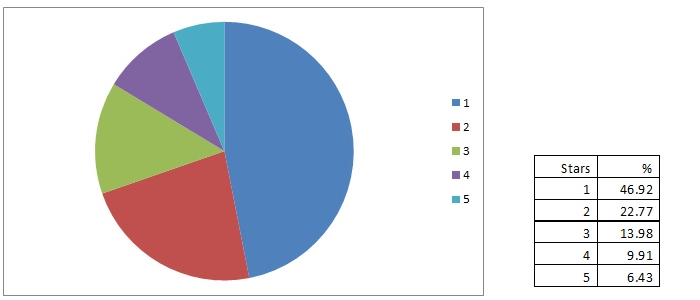

Data Science Capstone Project
=== 
author: Michael Fortune 
date: 22/11/2015
 

 
Yelp Data analysis - Introduction
=== 
For this project, I analysed the Yelp data, with a view to exploring primarily whether, or not it was possible predict reviews?
This in turn, looked at the following:  
- Does gender influence the content, or score of posted reviews?
- Are there seasonal differences in the content or score of posted reviews?
- Does the sentiment analysis of the review correlate to the scores?

Data and Methodology
===
The primary data set used for the project is the data set made available by Yelp. This includes around 600,000 businesses, 370,000 users and 1.5 million reviews.

I compiled a gender data set to match against the users names. The seasons were set to dates corresponding to the usual dates for the Northern Hemisphere e.g. USA, or UK, to be matched against the Review dates.

For Sentiment Analysis, I compiled a lexicon of positive, negative and neutral wording to compare the reviews against.

Results 
===
In a nutshell, neither seasonal variations, or gender revealed anything particularly useful, other than there seemed to be more review by females and slightly more overall in summer. Scores were similar throughout.

Sentiment is where there was a marked difference between the scores and the sentiment expressed in the reviews. THese often did not correlate e.g. negative sentiment vs stars

Discussion / Conclusion
===
Predicting reviews and scores is an uphill task. There is often little consistency between the scores and reviews and what one reviewer scores against a review may be completely different to another reviwer with a near identical review. Seasonal and gender variations do not provide much help. THere is also some evidence that reviwers may be influenced by previous reviews too. Availability of better demographic data would certainly help. Despite the deficiencies, many consumers make use of sites like Yelp before making a purchase, or otherwise spending money, as do businesses looking to improve their customer experiences and ultimately turnover. However, a more objective approach is what is desirable. 
