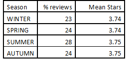
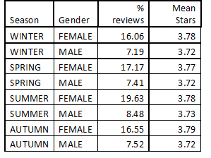

Data Science Specialization November 2015
===================================

Title 
------

I am interested in examining how the available business data may be analysed and processed with 
a view to predicting what scores and other sentiments future reviews may have for the same group of
businesses, or, all things being equal, other businesses with similar profiles.  

Introduction
----------------
The purpose of this report is to provide feedback from my research of the available YELP data 
with a view to answering a number of  questions relating to my interest in predictive analytics (supra),
 including:

a) whether review prediction is possible

b) whether there were gender or seasonal variations in review results

c) whether sentiment analysis of the reviews will aid prediction

I have attempted to answer these questions and both my mehodology and results are set out
below:

Methods and data
-------------------------

The available YELP dataset is is main data that is being used for this exercise. These are  
essentially data relating to reviews of various businesses, in a variety of locations, conatained in 
datasets i.e. businesses, users, reviews, check-ins and tips. In terms of volumes, these include, around:

60,000 Businesses,

370,000 Users, and 

1.5 million Reviews
 
As far as gender derivation from name is concerned, I compiled a list of male and female names 
and their variations and matched these to the names in the user list. I included only those where 
there was a match and there was no ambiguity e.g. Bobby could be Robert or Roberta etc. I also 
focused mainly on English names. The main source of gender data was the Complete US Census 
Bureau names list data, supplemented with Social Security data and data that I had previously 
comiled and used for other purposes. 

For the sake of simplicity, starts of seasons are defined follows:
20 Mar - Spring,

21 Jun - Summer,

23 Sep - Autumn, and 

21 Dec - Winter
   
Turning to sentiment analysis, in an attempt to extract, identify and characterise the sentiment content 
of reviews submitted, I compiled a lexicon of positive, negative and neutral words expressing 
sentiment and then matched these against the text contained in the reviews. Finally, I compared the
results with other review responses including e.g. stars to explore deviations in expected correlations. 
The words contained in my lexicon included words extracted from the lexicon produced by Bing Liu (UIC) 
as well as the Harvard Inquirer Dictionary.   

Results
----------

To begin with, there are seasonal variations, with the most review being submitted in Summer. This is 
significantly more than the other three seasons. Winter show a slight reduction.

As a simple barchart, this appears as follows:
======

What is apparent, is that there is little difference in the reviews (stars)

Looking at this more closely, we add Gender into the mix.

From this, it is clear that females apppear to be more active in posting reviews. However, once again, 
the average values do not show marked differences.

Looking at sentiment, this correlated well in many cases to the stars. People who have a negative experice 
are often more troubled by this than the converse with people having a positive experience e.g.

 
"I wish I could choose no stars. This is one of the worst...."

 "DO NOT GO HERE IF YOU HAVE YOUNG KIDS.."

"This place is horrible"

"HORRIBLE service"

There are many situations however, where the review and star ratings conflict. Take for example:

"..A great deal! ... they were tasty. A pretty good experience", 

"Good experience" and 

"I would definitely come back again"

and contrast these with:

"Quality has degraded", 

"Ugh", and 

"AWFUL EMPLOYEES"
 

All of the above, good and bad, are rated as three stars and you could find simlar comments up and down the scale. 

If we examine this more closely, starting with negative sentiment, then the % of each of the star rating categories is
represented by negative reviews as follows:
 

or visually, it looks like this

While you would expect the numbers to be closely correlated to the 1 and 2 star ratings, it is nevertheless surprising 
that there are so many reviews that seem to conflict with the star ratings.

The same is true of positive ratings:

 

and once again, visually, it looks like this

Here the vales for 4 and 5 stars are what you would expect. However, the results lower down are again surprising.

This illustrates perfectly the danger of relying on a single star score in isolation, as many of us do. Clearly, there 
must be a more accurate way of collecting better data, perhaps by rating a number of areas e.g. in a restaurant, 
this could include food, service, ambiance etc., with each being weighted appropriately if required, before 
arriving at a single score, it that is what is being aimed for. 

Discussion
---------------

At the outset, it should be stated that reviews are more subjective than objective and as such, the reviews 
and scores etc. may not be statistically valid. Nevertheless, they are opinions and are valid as such. The
study by Harvard Business School showed that in relation to Yelp, an increase of one star in translated to
an increase in revenue of between 5 and 9%. c.f Reviews, Reputation and Revenue: The case of Yelp.com,
by Professor Michael Luca.

It appears that across the board, women appear to dominate in terms of submission of reviews, while there
appears to be no difference between the average ratings given by men and women. Nevertheless, the average
ratings are rather higher than one might expect. When you post a review on Yelp, you cannot help notice the
previous reviews and the questions, "Do these reviews affect your score / post?". In this world of social media, 
there appears to be a desire to gravitate collectively to positive social influence i.e. a social influence bias.

Since negative experiences involve more thinking about, this sentiment is often expressed in stronger terms,
than positive experiences. There is also some evidence that younger people tend to write more negative 
reviews. The amount of money being spent and the expectation that follows, are also relevant.

In terms of predicting review scores, all the above are significant, but more important and lacking here, are all
the data required to support the prediction process. Typically, these will include age, income and levels of 
education etc. Some generalised profiling data are available (at a price) that may fill in some of the gaps, but 
persuading the reviewers to provide honest and accurate demographic data may be difficult. A survey may be 
the way forward.

Nevertheless, in our modern society, Yelp and the like play an important part in many businesses turnover and 
members of the public increasingly rely on review to may purchasing decisions. Ultimately, more data need to 
be collected to be able to produce a model for predicting futiure review scores and content. At the end of the day,
there are two main purposes for these reviews a) the business who can choose to treat the reviews as feedback 
to be acted upon if necessary, and b) members of the public who use the reviews as a guide to making a purchase.

In conclusion, it has been seen that predicting scores from reviews is fraught with problems. The value that one 
person assigns to a review may be different to another. In addition there is also the question of whether or not 
there is any significance to the influence of other reviewers postings. As far as seasonal variations are concerned, 
the only discernible difference is that there are more postings in Summer and slightly less in Winter. This is what 
 we would expect. Interestingly, women appear to post more than men, but in both the case of gender and seasons,
there appear to be no difference in the reviews and scores being posted.      